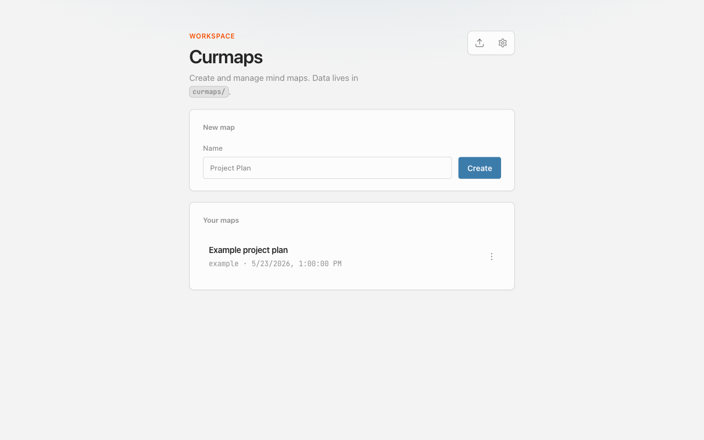
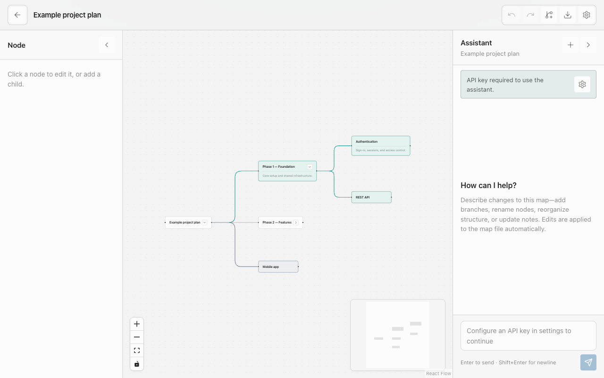
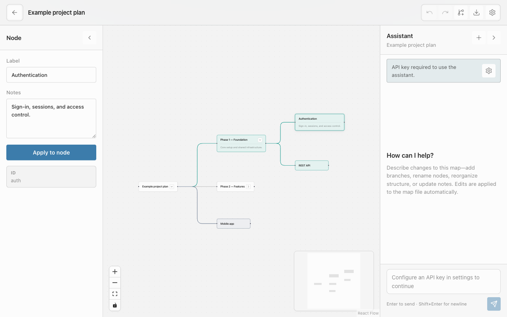
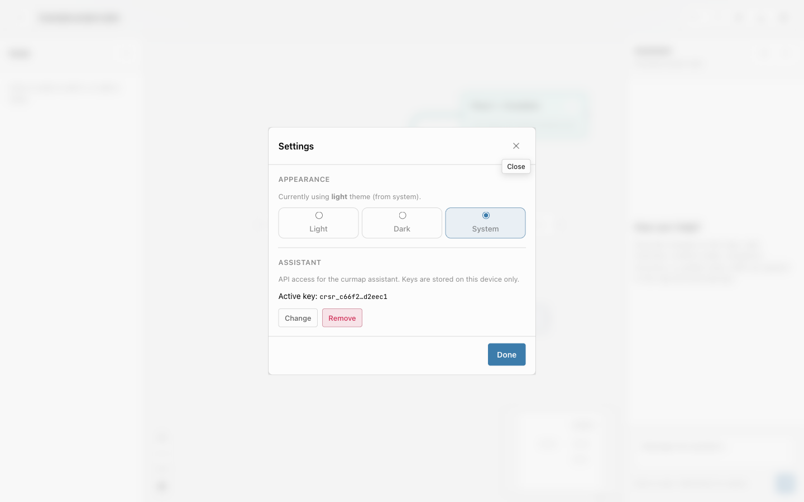

# Curmap

**Curmap** is a local-first mind map editor built with [**React Flow**](https://reactflow.dev/) (@xyflow/react). Each map is a JSON file in `curmaps/` so humans, agents, and the UI share the same format.

## Screenshots

**Home** — browse and create maps stored as JSON on disk.



**Editor** — tree layout, collapse branches, node colors, and notes.



**Node panel** — edit labels, notes, and colors for the selected node.



**Settings** — appearance and optional Cursor assistant API key (stored locally).



## Features

- Multiple mind maps as JSON on disk
- Tree layout (dagre), collapse branches, node colors and notes
- Markdown export/import (round-trip with the CLI)
- Optional **Cursor assistant** panel (local agent via [@cursor/sdk](https://cursor.com/docs/sdk/typescript))
- CLI for scripting and agent workflows

## Quick start

Requires [Node.js](https://nodejs.org/) 20+ and [pnpm](https://pnpm.io/).

```bash
pnpm install
cp .env.example .env   # optional: CURSOR_API_KEY for in-app chat
pnpm run dev
```

- **UI**: http://localhost:5173 (home) · `http://localhost:5173/curmaps/<id>` (editor)
- **API**: http://localhost:3847

A sample map ships at `curmaps/example.json`. Your own maps are just more `.json` files in that folder.

### In-app Cursor chat

Open a map in the editor. The **Assistant** panel uses a **local agent** against this repo and can edit `curmaps/<id>.json` from natural language (for example: “add a branch for Q3 under root”).

1. Create an API key at [Cursor Integrations](https://cursor.com/dashboard/integrations).
2. Open **Settings** (gear icon), go to **Assistant**, paste the key, and click **Save**.

The key is sent once to the local API (`127.0.0.1` only), encrypted with AES-256-GCM, and stored under `~/.curmap/` (mode `600`). The browser only sees a masked preview afterward.

Alternatively, set `CURSOR_API_KEY` in `.env` or your environment (overrides the in-app saved key).

See [SECURITY.md](./SECURITY.md) for key handling and what not to commit.

## CLI (agent-friendly)

```bash
pnpm run curmap -- list
pnpm run curmap -- create "Product Roadmap"
pnpm run curmap -- add-node product-roadmap root auth "Authentication"
pnpm run curmap -- show product-roadmap
pnpm run curmap -- duplicate product-roadmap
pnpm run curmap -- export product-roadmap --out product-roadmap.md
pnpm run curmap -- import product-roadmap.md
```

In the editor, **Export** downloads the current map as Markdown (including unsaved on-screen edits). Run **import** to write it back to `curmaps/<id>.json`.

See [AGENTS.md](./AGENTS.md) for the full agent workflow and JSON schema.

## Stack

- **@xyflow/react** — mind map canvas
- **dagre** — tree layout
- **Zod** — shared validation (`shared/schema.ts`)
- **Express** — REST API
- **@cursor/sdk** — optional local Cursor agent
- **Vite + React** — frontend

## Project layout

```
curmaps/           # JSON data (one file per map)
shared/            # Schema, layout, import/export
server/            # REST API + optional chat
scripts/           # CLI
src/               # React UI
```

## License

[MIT](./LICENSE) — see [CONTRIBUTING.md](./CONTRIBUTING.md) for development notes.
